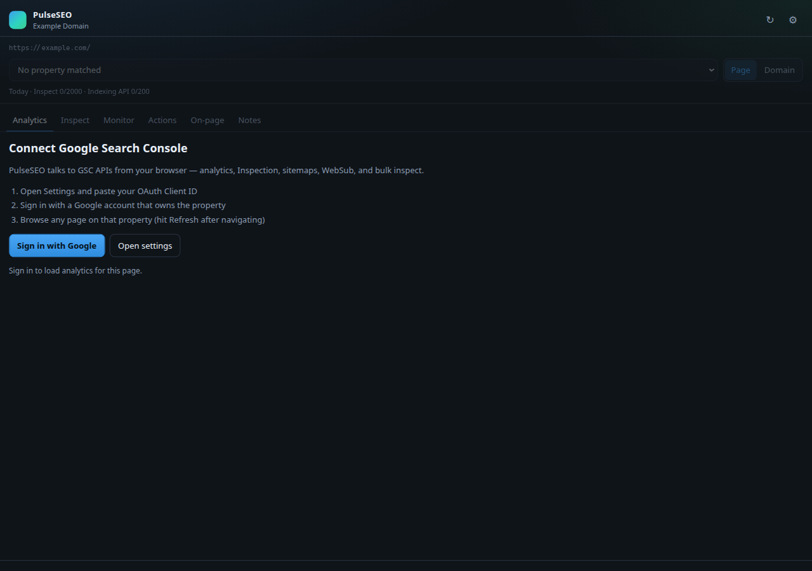
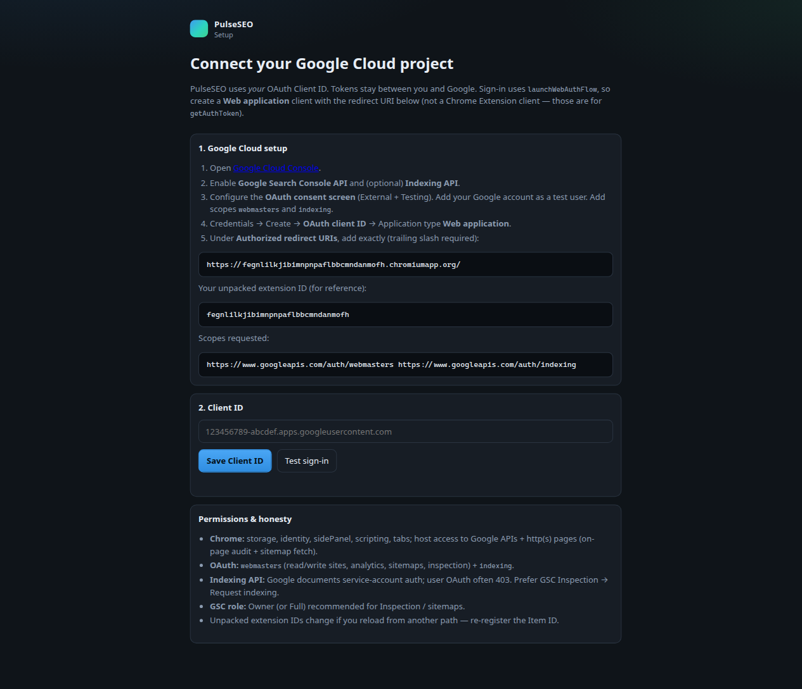
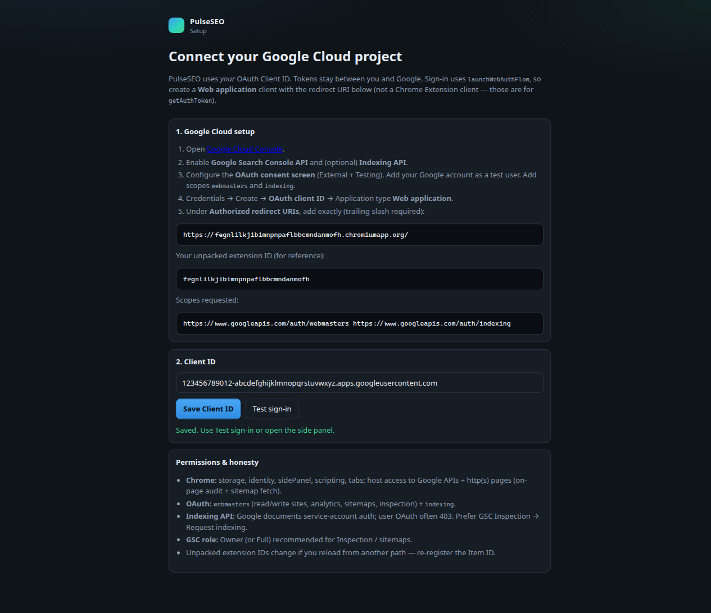

# PulseSEO — GSC Command Center

Chrome **Manifest V3** side panel for Google Search Console: live analytics, URL Inspection, sitemap / WebSub, bulk inspect, on-page SEO audit, and local notes — **without an SEO Gets (or other SaaS) account**.

> Lives in [`domainpulse`](https://github.com/seankrux/domainpulse) under `chrome-extension/`.  
> PR: https://github.com/seankrux/domainpulse/pull/76

---

## Screenshots

### Sign-in gate (side panel)



Connect Google Search Console from the side panel while browsing a page you manage. Context shows the current URL, property picker, and daily Inspect / Indexing API quota meter.

### Settings (OAuth Client ID)



Paste your **Web application** OAuth Client ID. The page shows your extension ID, the exact `chromiumapp.org` redirect URI, and requested scopes.

### After saving Client ID



Use **Test sign-in** to validate the OAuth round-trip before using the side panel.

---

## Competitive context

| Capability | SEO Gets Anywhere | GSC-URL-Indexer | IndexWizard / Leo | **PulseSEO** |
| --- | --- | --- | --- | --- |
| Page/domain GSC metrics + growing/decaying queries | Yes (SaaS) | — | CLI / web | **Yes (direct API)** |
| Annotations | SaaS sync | — | — | **Local notes + chart markers** |
| URL Inspection | — | Via GSC UI automation | API | **API + deep link** |
| Request indexing | — | GSC UI automation | Indexing API | **GSC deep link (primary) + Indexing API try** |
| Sitemap submit + WebSub ping | — | — | Leo ping | **Yes** |
| Bulk sitemap inspect + CSV | — | Queue/badge | Export | **Monitor tab (≤25/run) + CSV** |
| Quota meter | — | ~10/day UI | — | **Header meter (Inspect / Indexing)** |
| On-page DOM audit | — | — | — | **Yes** |
| Device / search-type filters | SaaS | — | — | **Yes** |
| Requires paid SaaS | Yes | No | No | **No** |

SEO Gets Anywhere is read-only analytics + annotations against their backend. GSC-URL-Indexer automates the GSC UI (fragile / ToS-sensitive). Leo adds sitemap → inspect → submit + WebSub. PulseSEO combines the analytics UX with official APIs and honest Indexing API limits.

---

## Install (unpacked)

1. Open `chrome://extensions` → enable **Developer mode** → **Load unpacked** → select this folder (`chrome-extension/` in the repo, or a copied `PulseSEO/` folder).
2. Copy the extension **ID** shown on the card (or in Options).
3. In [Google Cloud Console](https://console.cloud.google.com/):
   - Enable **Google Search Console API** (and optionally **Indexing API**).
   - **OAuth consent screen** → External → Testing → add your Google account as a **test user**.
   - Add scopes: `webmasters` and `indexing` (full URLs are shown in Options).
   - **Credentials** → Create **OAuth client ID** → type **Web application**.
   - Under **Authorized redirect URIs**, add exactly (trailing slash required):

     `https://<EXTENSION_ID>.chromiumapp.org/`

   - Do **not** use a “Chrome Extension” client type — that is for `chrome.identity.getAuthToken`, not `launchWebAuthFlow`.
4. Extension **Options** (gear in the side panel, or extension Details → Extension options) → paste Client ID → **Save** → **Test sign-in**.
5. Browse an `http(s)` page on a Search Console property you own → open the PulseSEO side panel → **Sign in with Google**.

### Permissions

| Layer | Details |
| --- | --- |
| **Chrome** | `storage`, `identity`, `sidePanel`, `scripting`, `tabs` |
| **Hosts** | Google APIs (`googleapis.com`, `searchconsole.googleapis.com`, `indexing.googleapis.com`, `oauth2.googleapis.com`), WebSub hub, `http(s)://*/*` (on-page audit + sitemap fetch) |
| **OAuth** | `https://www.googleapis.com/auth/webmasters`, `https://www.googleapis.com/auth/indexing` |
| **GSC role** | Owner / Full recommended for Inspection and sitemap writes |

### Indexing — what actually works

- **Supported path:** Actions → **Open GSC Inspection** → use Google’s **Request indexing** button.
- **Experimental:** Indexing API `URL_UPDATED` / `URL_DELETED` with the user OAuth token. Google documents **service-account** auth for this API; user tokens often **403**. PulseSEO surfaces that error and still offers the GSC deep link.

---

## Tabs

| Tab | Features |
| --- | --- |
| **Analytics** | Page/domain metrics, prior-period deltas, device + search-type filters, trend chart with note markers, growing / decaying / new queries, CSV export |
| **Inspect** | URL Inspection API detail + export JSON + open GSC |
| **Monitor** | Load sitemap / paste URLs → bulk inspect (25/run) → Indexed / Not / Error filters → CSV |
| **Actions** | GSC Inspection deep link, Indexing API try, sitemap submit + WebSub ping |
| **On-page** | Live DOM audit (title, meta, canonical, robots, OG, H1, JSON-LD, issues) |
| **Notes** | Local page / property annotations |

The **quota meter** (Inspect / Indexing API counts for today) lives in the shared header under the property picker — not only on Actions.

Context **auto-refreshes** when the **active** http(s) tab changes or finishes loading. Hit **Refresh** if a page is still loading. If the focused tab is `chrome://` or the extension page, PulseSEO falls back to another http(s) tab in the window when possible.

**Property matching:** longest URL-prefix (same origin + path) → then `sc-domain:`. No unsafe host-prefix string matching; no silent www↔apex URL-prefix bind. If only `www.` is verified as a URL-prefix property, open the www URL (or use Domain scope / an `sc-domain:` property).

---

## Develop / test

From the DomainPulse repo root:

```bash
npm run test:ext        # pure helper tests (matchProperty, dates, deltas, SSRF, client id)
npm run test:ext:live   # load unpacked in Playwright Chromium and dry-run UI
```

No build step — load the folder as unpacked.

---

## Security notes

- Messages accepted only from this extension’s pages (`sender.id` + `chrome-extension://` URL).
- External tabs open only to allowlisted hosts (`search.google.com`, Cloud Console, Google account).
- Mutating GSC calls verify the property is owned and the URL belongs to it.
- Sitemap fetches block private / link-local hosts and track visited URLs (SSRF / cycle guard).
- Access tokens live in `chrome.storage.session`; Client ID in `sync`; notes / quota in `local`.
- Implicit OAuth (`response_type=token`) — no refresh token; silent `prompt=none` when possible.
- Auth gate always shows when unsigned-in (never “Sign out” without a session).

---

## Layout

```
chrome-extension/
  manifest.json
  background/service-worker.js
  lib/{auth,gsc,dates,quota,constants,ssrf}.js
  content/page-audit.js
  sidepanel/{index.html,app.js,styles.css}
  options/{index.html,options.js}
  icons/
  docs/screenshots/          # README screenshots
  tests/{gsc-helpers,live-dry-run}.mjs
  README.md
```

---

## Privacy / visibility

This package ships inside the **domainpulse** GitHub repository. If you need the source private, set the repo to **Private** in GitHub → Settings → General → Danger Zone → Change repository visibility (org/admin required). Do not publish the OAuth Client ID or tokens in issues or public forks.
