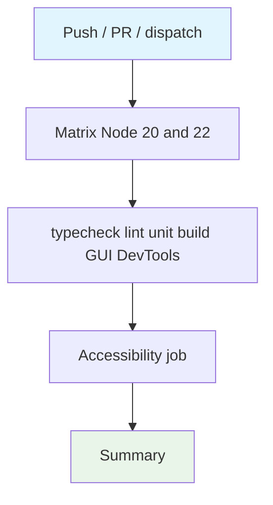

## Workflow Overview

**Purpose**: Matrixed Node 20/22 quality suite plus a dependent accessibility job.
**Trigger Events**: Push to main/master/develop; PR to main/master; manual dispatch.
**Target Environments**: Ephemeral Ubuntu CI.

## Execution Flow Diagram

## Jobs & Dependencies

| Job Name | Purpose | Dependencies | Execution Context |
|---|---|---|---|
| test | Full quality matrix | none | ubuntu-latest, Node 20.x/22.x |
| accessibility | GUI a11y after tests | test | ubuntu-latest, Node 20 |
| summary | Status table | test, accessibility | always() |

## Requirements Matrix

| ID | Requirement | Priority | Acceptance Criteria |
|---|---|---|---|
| REQ-001 | Cancel superseded runs | High | concurrency group per ref |
| REQ-002 | Both Node majors pass | High | matrix includes 20.x and 22.x |
| REQ-003 | Reports retained | Medium | artifacts 7 days |

## Secrets & Variables

None required.

## Execution Constraints

- Concurrency cancels in-progress runs on the same ref
- Playwright Chromium with OS deps
- Accessibility starts a local dev server

## Error Handling Strategy

| Error Type | Response | Recovery |
|---|---|---|
| Matrix leg fails | accessibility skipped | Fix failing Node version |
| A11y fails | summary still runs | Inspect GUI report |

## Quality Gates

| Gate | Criteria | Bypass |
|---|---|---|
| Typecheck/lint/unit/build/GUI | all steps pass | none |
| Accessibility | dedicated job after test | none |

## Validation Criteria

- VLD-001: concurrency cancel-in-progress is true
- VLD-002: summary runs even when prior jobs fail

## Change Management

| Version | Date | Changes | Author |
|---|---|---|---|
| 1.0 | 2026-08-23 | Initial specification | fleet audit |
