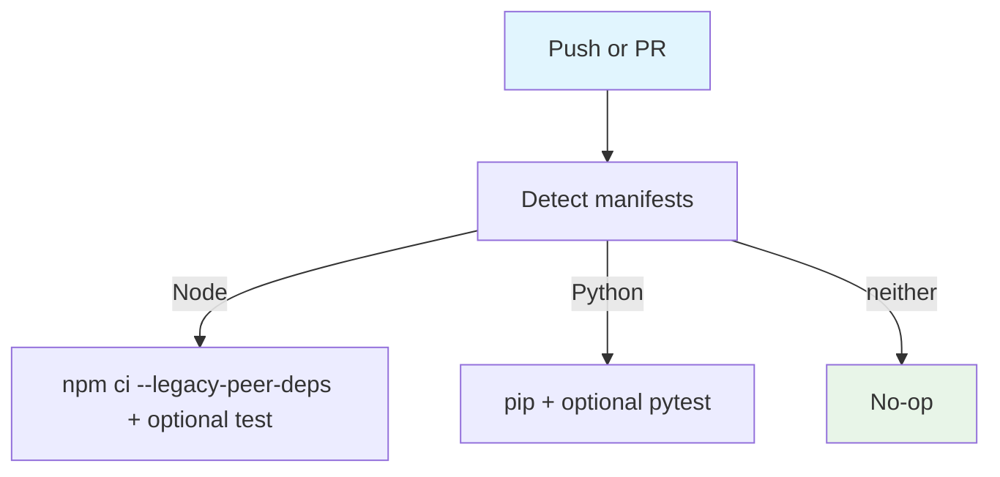

## Workflow Overview

**Purpose**: Detect Node/Python and run a best-effort install/test path. DomainPulse uses `--legacy-peer-deps`.
**Trigger Events**: Push to `main`/`master`; all pull requests.
**Target Environments**: Ephemeral Ubuntu CI.

## Execution Flow Diagram

## Jobs & Dependencies

| Job Name | Purpose | Dependencies | Execution Context |
|---|---|---|---|
| detect-and-run | Stack detect + optional tests | none | ubuntu-latest |

## Requirements Matrix

| ID | Requirement | Priority | Acceptance Criteria |
|---|---|---|---|
| REQ-001 | Node install uses legacy peer deps | High | `--legacy-peer-deps` present |
| REQ-002 | Tests optional | Medium | Missing script does not fail |

## Secrets & Variables

None.

## Execution Constraints

Default runner; npm/PyPI network.

## Error Handling Strategy

| Error Type | Response | Recovery |
|---|---|---|
| Install failure | Job fails | Repair lockfile |
| Test missing | Continue | Add real tests |

## Quality Gates

This workflow is not a hard quality gate. Prefer `automated-tests.yml`.

## Validation Criteria

- VLD-001: Node path uses legacy peer deps
- VLD-002: No secrets referenced

## Change Management

| Version | Date | Changes | Author |
|---|---|---|---|
| 1.0 | 2026-08-23 | Initial specification | fleet audit |
