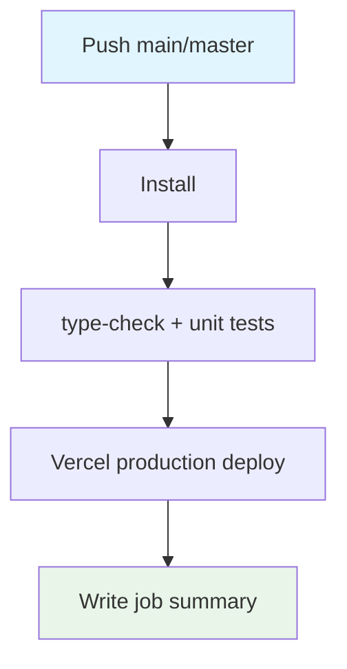

## Workflow Overview

**Purpose**: Typecheck, unit-test, then publish production to Vercel on default-branch pushes.
**Trigger Events**: Push to `main`/`master` only.
**Target Environments**: Vercel production environment.

## Execution Flow Diagram

## Jobs & Dependencies

| Job Name | Purpose | Dependencies | Execution Context |
|---|---|---|---|
| deploy | Test then production deploy | none | ubuntu-latest, environment=production |

## Requirements Matrix

| ID | Requirement | Priority | Acceptance Criteria |
|---|---|---|---|
| REQ-001 | No PR production deploys | High | `on.push` only |
| REQ-002 | Tests before deploy | High | type-check + unit tests run first |
| REQ-003 | Org/project from secrets | High | No hardcoded Vercel IDs |

## Secrets & Variables

| Type | Name | Purpose | Scope |
|---|---|---|---|
| Secret | VERCEL_TOKEN | CLI/action auth | Workflow |
| Secret | VERCEL_ORG_ID | Target team | Workflow |
| Secret | VERCEL_PROJECT_ID | Target project | Workflow |
| Secret | GITHUB_TOKEN | Action GitHub integration | Workflow |

## Execution Constraints

- Production environment URL comes from the deploy action output
- Node 20 + npm cache + `--legacy-peer-deps`

## Error Handling Strategy

| Error Type | Response | Recovery |
|---|---|---|
| Test failure | Deploy skipped | Fix tests |
| Missing Vercel secret | Deploy fails | Configure secrets |

## Quality Gates

| Gate | Criteria | Bypass |
|---|---|---|
| Typecheck | npm run type-check | none |
| Unit tests | npm run test:unit -- --run | none |

## Validation Criteria

- VLD-001: Workflow does not run on pull_request
- VLD-002: Secrets used for org/project IDs

## Change Management

| Version | Date | Changes | Author |
|---|---|---|---|
| 1.0 | 2026-08-23 | Initial specification | fleet audit |
