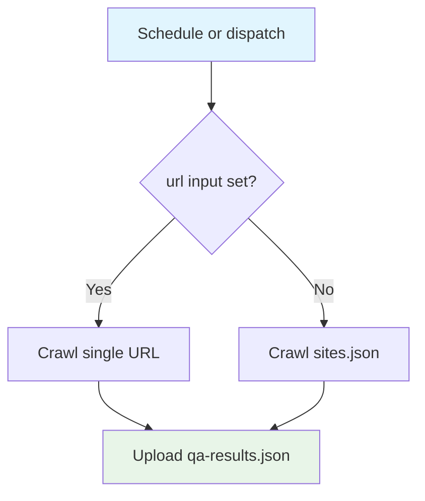

## Workflow Overview

**Purpose**: Crawl configured sites, exercise forms, and check Call Now buttons.
**Trigger Events**: Daily 06:00 UTC; manual dispatch with optional single URL.
**Target Environments**: Ephemeral Ubuntu CI against live or listed sites.

## Execution Flow Diagram

## Jobs & Dependencies

| Job Name | Purpose | Dependencies | Execution Context |
|---|---|---|---|
| qa-crawl | Playwright QA crawl | none | ubuntu-latest, 30 min, Node 22 |

## Requirements Matrix

| ID | Requirement | Priority | Acceptance Criteria |
|---|---|---|---|
| REQ-001 | Single-URL override | High | `--url` used when input present |
| REQ-002 | Default config path | High | `--config sites.json` otherwise |
| REQ-003 | Results artifact | Medium | `data/qa-results.json` uploaded |

## Secrets & Variables

None in the workflow file. Crawl targets come from `sites.json` or the input URL.

## Execution Constraints

- 30 minute timeout
- Chromium + OS deps

## Error Handling Strategy

| Error Type | Response | Recovery |
|---|---|---|
| Crawl failure | Job fails; artifact still attempted | Inspect qa-results |
| Missing results file | Upload warns | Confirm writer path |

## Validation Criteria

- VLD-001: Dispatch accepts optional url
- VLD-002: Schedule cron is daily 06:00 UTC

## Change Management

| Version | Date | Changes | Author |
|---|---|---|---|
| 1.0 | 2026-08-23 | Initial specification | fleet audit |
