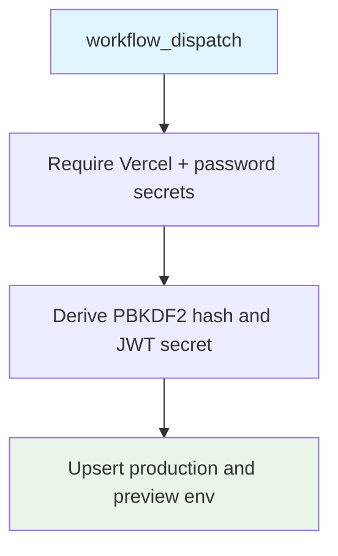

## Workflow Overview

**Purpose**: Manually upsert `PASSWORD_HASH` and `JWT_SECRET` on the Vercel project so the preview/production lock gate can activate.
**Trigger Events**: Manual `workflow_dispatch` only.
**Target Environments**: Vercel production and preview env scopes.

## Execution Flow Diagram



## Jobs & Dependencies

| Job Name | Purpose | Dependencies | Execution Context |
|---|---|---|---|
| set-env | Write auth env vars | none | ubuntu-latest |

## Requirements Matrix

| ID | Requirement | Priority | Acceptance Criteria |
|---|---|---|---|
| REQ-001 | Manual only | High | No push/PR trigger |
| REQ-002 | Password from secret | High | No plaintext password in YAML |
| REQ-003 | Fail closed | High | Missing PREVIEW_GATE_PASSWORD exits 1 |

### Security Requirements
| ID | Requirement | Implementation Constraint |
|---|---|---|
| SEC-001 | Never commit the gate password | Use `PREVIEW_GATE_PASSWORD` |
| SEC-002 | Rotate JWT on each run | Generate a fresh 32-byte hex secret |
| SEC-003 | Do not echo password or hash | Logs may list env names only |

## Input/Output Contracts

```yaml
VERCEL_TOKEN: secret
VERCEL_ORG_ID: secret
VERCEL_PROJECT_ID: secret
PREVIEW_GATE_PASSWORD: secret
```

## Execution Constraints

- Operator must confirm VERCEL_TOKEN is valid before running
- Writes both production and preview

## Error Handling Strategy

| Error Type | Response | Recovery |
|---|---|---|
| Missing Vercel secret | Fail | Configure secrets |
| Missing password secret | Fail | Set PREVIEW_GATE_PASSWORD |
| Vercel CLI error | Fail | Rotate token / check project IDs |

## Edge Cases

| Scenario | Expected Behavior |
|---|---|
| Re-run | Old PASSWORD_HASH/JWT_SECRET removed then re-added |
| Public fork PR | Workflow cannot run; dispatch only |

## Validation Criteria

- VLD-001: YAML contains no `1111` password
- VLD-002: `PREVIEW_GATE_PASSWORD` is injected as an env secret
- VLD-003: Trigger is workflow_dispatch only

## Change Management

| Version | Date | Changes | Author |
|---|---|---|---|
| 1.0 | 2026-08-23 | Spec after removing hardcoded preview password | fleet audit |
